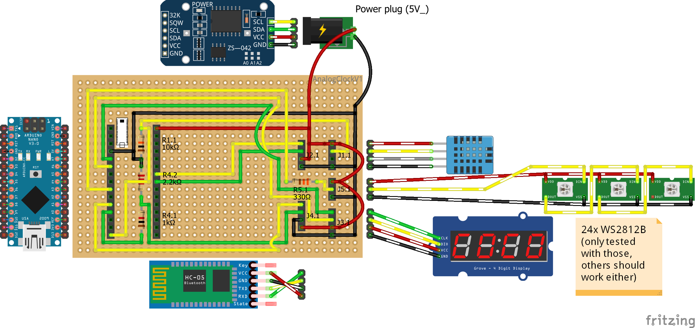
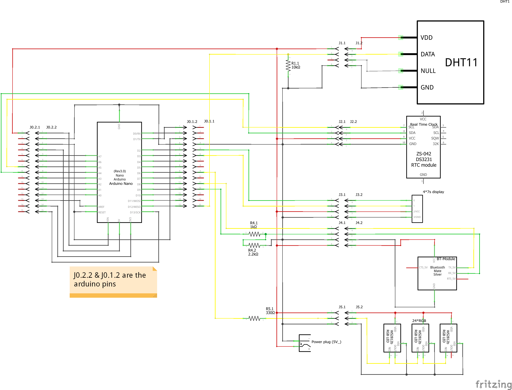
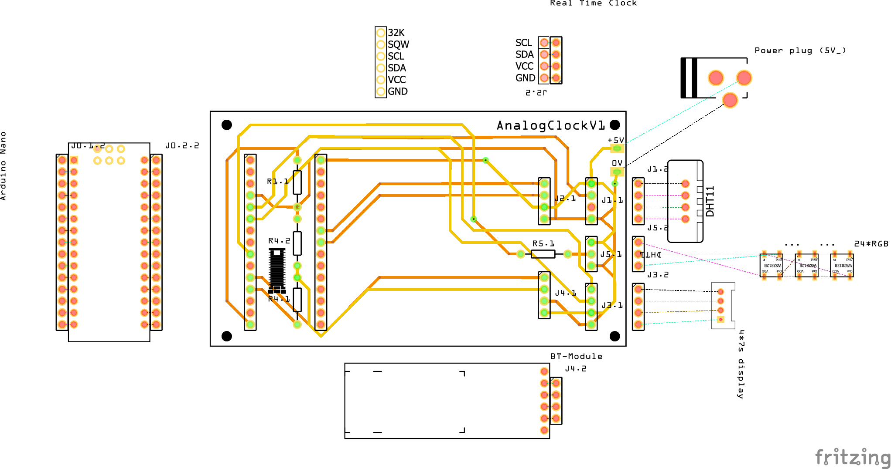
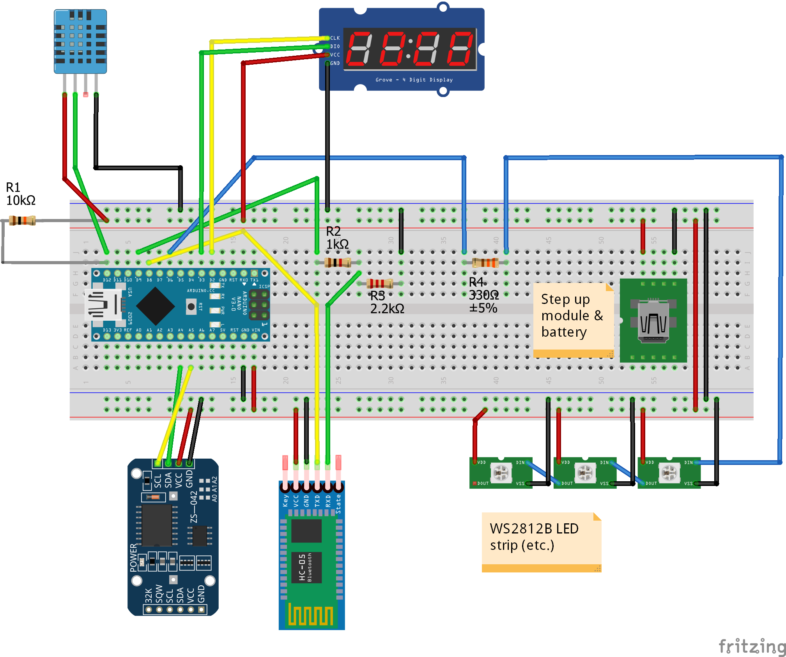

# Hardware

## Perfboard (Tested, R1.1 need to be a pull up resistor):

_To solder the back side, mirror the image_

## Wiring Diagram (Tested with perf-/breadboard, R1.1 need to be a pull up resistor):

## PCB (untested, R1.1 need to be a pull up resistor):

## [Fritzing File](wiring/AnalogClockV1.fzz) (pics above are from here)

## Breadboard (OLD, R1.1 is ok):

